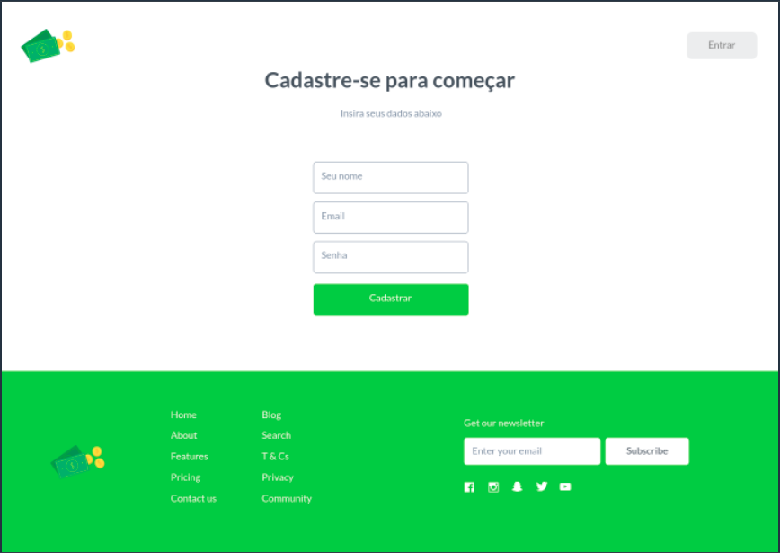

# Informações do Projeto
`TÍTULO DO PROJETO`  

MoneyHelper 💰

`CURSO` 

Ciência da Computação - Praça da Liberdade

## Participantes

- Gabriel Ribeiro Souza Silva
- Mateus Nunes Guerra Ribeiro
- Pedro Caldera do Amaral Fonseca

# Estrutura do Documento

- [Informações do Projeto](#informações-do-projeto)
  - [Participantes](#participantes)
- [Estrutura do Documento](#estrutura-do-documento)
- [Introdução](#introdução)
  - [Problema](#problema)
  - [Objetivos](#objetivos)
  - [Justificativa](#justificativa)
  - [Público-Alvo](#público-alvo)
- [Especificações do Projeto](#especificações-do-projeto)
  - [Personas e Mapas de Empatia](#personas-e-mapas-de-empatia)
  - [Histórias de Usuários](#histórias-de-usuários)
  - [Requisitos](#requisitos)
    - [Requisitos Funcionais](#requisitos-funcionais)
    - [Requisitos não Funcionais](#requisitos-não-funcionais)
  - [Restrições](#restrições)
- [Projeto de Interface](#projeto-de-interface)
  - [User Flow](#user-flow)
  - [Wireframes](#wireframes)
- [Metodologia](#metodologia)
  - [Divisão de Papéis](#divisão-de-papéis)
  - [Ferramentas](#ferramentas)
  - [Controle de Versão](#controle-de-versão)
- [**############## SPRINT 1 ACABA AQUI #############**](#-sprint-1-acaba-aqui-)
- [Projeto da Solução](#projeto-da-solução)
  - [Tecnologias Utilizadas](#tecnologias-utilizadas)
  - [Arquitetura da solução](#arquitetura-da-solução)
- [Avaliação da Aplicação](#avaliação-da-aplicação)
  - [Plano de Testes](#plano-de-testes)
  - [Ferramentas de Testes (Opcional)](#ferramentas-de-testes-opcional)
  - [Registros de Testes](#registros-de-testes)
- [Referências](#referências)

# Introdução

## Problema

Por que a taxa de endividamento entre os jovens está tão alta no Brasil ?

## Objetivos

Ajudar os jovens adultos a terem um melhor controle de sua renda, quitar ou diminuir suas dívias e também de ajudá-los a pouparem seu dinheiro.

## Justificativa

Falta de educação financeira e acesso facilitado ao crédito.

## Público-Alvo

Jovens adultos de 18 à 29 anos que estão iniciando no mercado de trabalho.
 
# Especificações do Projeto

Queremos criar um site funcional e simples que ajude as pessoas a controlarem suas proprias finanças, nosso objetivo é educar o usuário sobre um dos assuntos mais importântes da vida adulta, o dinheiro. 
Mesmo que em nossa socidade "falar sobre dinheiro" seja um tabu, é muito importante o conhecimento sobre educação financeira e administração de renda.

## Personas e Mapas de Empatia

### Personas

### Mapas de Empatia

## Histórias de Usuários

Com base na análise das personas forma identificadas as seguintes histórias de usuários:

|EU COMO... `PERSONA`| QUERO/PRECISO ... `FUNCIONALIDADE`            |PARA ... `MOTIVO/VALOR`                            |
|--------------------|-----------------------------------------------|---------------------------------------------------|
|Cleiton Ferreira    | Utilizar a planilha e quitar suas dívidas     | Quer quitar suas dívidas que fez no cartão de crédito|
|Adriano Melo        | Aprender sobre invetimentos                   | Quer planejar melhor o futuro                     |
|Hudson Gomes        | Utilizar a planilha de forma rápida           | Quer ganhar tempo com uma planilha simples e rápida|
|Cleiton Ferreira    | Aprender sobre os diferentes tipos de dívidas | Não quer fazer novas dívidas                      |
|Adriano Melo        | Aprender a guardar dinheiro                   | Não ter que se preocupar com dinheiro no futuro   |
|Hudson Gomes        | Quer ensinar pra família sobre finanças       | Quer educar o filho desde pequeno sobre investimentos e dívidas |

## Requisitos

As tabelas que se seguem apresentam os requisitos funcionais e não funcionais que detalham o escopo do projeto.

### Requisitos Funcionais

|ID    | Descrição do Requisito  | Prioridade |
|------|---------------------------------------------|----|
|RF-001| Criar o site                                | ALTA  | 
|RF-002| Permitir que o usuário se cadastre no site  | ALTA  |
|RF-003| Permitir que o usuário faça login no site   | ALTA  |
|RF-004| Planilha interativa                         | ALTA  |
|RF-005| Receber dados específicos de cada usuário   | MÉDIA |
|RF-006| Reconhecer os problemas de cada usuário por meio dos dados enviados  | MÉDIA |
|RF-007| Por meio dos problemas reconhecidos do usuário dar dicas específicas | MÉDIA |
|RF-008| Permitir que o usuário escolha temas para receber dicas  | MÉDIA |
|RF-009| Disponibilizar dicas sobre dívidas, investimentos e educação financeira  | MÉDIA |
|RF-010| Dar nóticias sobre o mundo das finaças  | BAIXA |

### Requisitos não Funcionais

|ID     | Descrição do Requisito  |Prioridade |
|-------|-------------------------|----|
|RNF-001| O sistema deve ser responsivo em computadores e celulares | MÉDIA | 
|RNF-002| Deve processar requisições do usuário no menor tempo possível |  BAIXA | 

## Restrições

O projeto está restrito pelos itens apresentados na tabela a seguir.

|ID| Restrição                                             |
|--|-------------------------------------------------------|
|01| O projeto deverá ser entregue até o final do semestre |
|02| Não pode ser desenvolvido um módulo de backend        |
|03| O trabalho deve ser entregue em 4 sprints.            |

# Projeto de Interface

O projeto foi feito com base nos pontos apresentados anteriormente (Requisitos, Histórias de Usuários e Personas). Primeiro foi feito o User Flow e logo após fizemos os Wireframes com base no User Flow. Utilizamos duas plataformas diferentes para realizarmos o projeto, o MarvelApp e o Wireflow.co.

## User Flow

## Wireframes

### Página Principal
Primeira página que será aberta quando abrir o site. Apresentando algumas informações para o usuário e links para que ele possa navegar por ele.

### Página de Cadastro
Página onde o usuário pode realizar um cadastro dentro do site.

### Página de Login
Página onde o usuário irá entrar em sua conta no site se já possuir um cadastro.

### Página do Usuário
Página que será aberta após o login do usuário no site, contendo informações customizadas e dicas.

# Metodologia

Utilizamos as plataformas recomendadas pelos professores. Como nosso grupo só tem 3 participantes decidimos fazer o trabalho juntos, logo todos os alunos ajudaram em todas as partes. 
O processo de Design Thinking foi feito no miro utilizando o TEMPLATE disponibilizado pelos professores.
A parte de WireFrame e UserFlow fizemos com as plataformas disponibilizadas durante as aulas de TIAW e DIW.

Miro – Design Thinking.

MarvelApp – Wireframe

User Flow – Wireflow.co

## Divisão de Papéis

|Membros  | Função          |
|---------|-----------------|
|Gabriel  | Desenvolvedor   |
|Mateus   | Desenvolvedor   |
|Pedro    | Desenvolvedor   |

## Ferramentas

| Ambiente  | Plataforma              |Link de Acesso |
|-----------|-------------------------|---------------|
|Processo de Design Thinkgin  | Miro |  https://miro.com/app/board/uXjVO5Fp1ak=/ | 
|Repositório de código | GitHub | https://github.com/ICEI-PUC-Minas-PPLCC-TI/tiaw-ppl-cc-m-20221-t1-g5 | 
|Hospedagem do site | Heroku |  https://XXXXXXX.herokuapp.com | 
|Protótipo Interativo | MavelApp | https://marvelapp.com/prototype/177f3h89 | 

## Controle de Versão

A ferramenta de controle de versão adotada no projeto foi o
[Git](https://git-scm.com/), sendo que o [Github](https://github.com)
foi utilizado para hospedagem do repositório `upstream`.

O projeto segue a seguinte convenção para o nome de branchs:

- `master`: versão estável já testada do software
- `unstable`: versão já testada do software, porém instável
- `testing`: versão em testes do software
- `dev`: versão de desenvolvimento do software

Quanto à gerência de issues, o projeto adota a seguinte convenção para
etiquetas:

- `bugfix`: uma funcionalidade encontra-se com problemas
- `enhancement`: uma funcionalidade precisa ser melhorada
- `feature`: uma nova funcionalidade precisa ser introduzida

# **############## SPRINT 1 ACABA AQUI #############**

# Projeto da Solução

......  COLOQUE AQUI O SEU TEXTO ......

## Tecnologias Utilizadas

......  COLOQUE AQUI O SEU TEXTO ......

> Descreva aqui qual(is) tecnologias você vai usar para resolver o seu
> problema, ou seja, implementar a sua solução. Liste todas as
> tecnologias envolvidas, linguagens a serem utilizadas, serviços web,
> frameworks, bibliotecas, IDEs de desenvolvimento, e ferramentas.
> Apresente também uma figura explicando como as tecnologias estão
> relacionadas ou como uma interação do usuário com o sistema vai ser
> conduzida, por onde ela passa até retornar uma resposta ao usuário.
> 
> Inclua os diagramas de User Flow, esboços criados pelo grupo
> (stoyboards), além dos protótipos de telas (wireframes). Descreva cada
> item textualmente comentando e complementando o que está apresentado
> nas imagens.

## Arquitetura da solução

......  COLOQUE AQUI O SEU TEXTO E O DIAGRAMA DE ARQUITETURA .......

> Inclua um diagrama da solução e descreva os módulos e as tecnologias
> que fazem parte da solução. Discorra sobre o diagrama.
> 
> **Exemplo do diagrama de Arquitetura**:
> 
> 

# Avaliação da Aplicação

......  COLOQUE AQUI O SEU TEXTO ......

> Apresente os cenários de testes utilizados na realização dos testes da
> sua aplicação. Escolha cenários de testes que demonstrem os requisitos
> sendo satisfeitos.

## Plano de Testes

......  COLOQUE AQUI O SEU TEXTO ......

> Enumere quais cenários de testes foram selecionados para teste. Neste
> tópico o grupo deve detalhar quais funcionalidades avaliadas, o grupo
> de usuários que foi escolhido para participar do teste e as
> ferramentas utilizadas.
> 
> **Links Úteis**:
> - [IBM - Criação e Geração de Planos de Teste](https://www.ibm.com/developerworks/br/local/rational/criacao_geracao_planos_testes_software/index.html)
> - [Práticas e Técnicas de Testes Ágeis](http://assiste.serpro.gov.br/serproagil/Apresenta/slides.pdf)
> -  [Teste de Software: Conceitos e tipos de testes](https://blog.onedaytesting.com.br/teste-de-software/)

## Ferramentas de Testes (Opcional)

......  COLOQUE AQUI O SEU TEXTO ......

> Comente sobre as ferramentas de testes utilizadas.
> 
> **Links Úteis**:
> - [Ferramentas de Test para Java Script](https://geekflare.com/javascript-unit-testing/)
> - [UX Tools](https://uxdesign.cc/ux-user-research-and-user-testing-tools-2d339d379dc7)

## Registros de Testes

......  COLOQUE AQUI O SEU TEXTO ......

> Discorra sobre os resultados do teste. Ressaltando pontos fortes e
> fracos identificados na solução. Comente como o grupo pretende atacar
> esses pontos nas próximas iterações. Apresente as falhas detectadas e
> as melhorias geradas a partir dos resultados obtidos nos testes.

# Referências

......  COLOQUE AQUI O SEU TEXTO ......

> Inclua todas as referências (livros, artigos, sites, etc) utilizados
> no desenvolvimento do trabalho.
> 
> **Links Úteis**:
> - [Formato ABNT](https://www.normastecnicas.com/abnt/trabalhos-academicos/referencias/)
> - [Referências Bibliográficas da ABNT](https://comunidade.rockcontent.com/referencia-bibliografica-abnt/)
